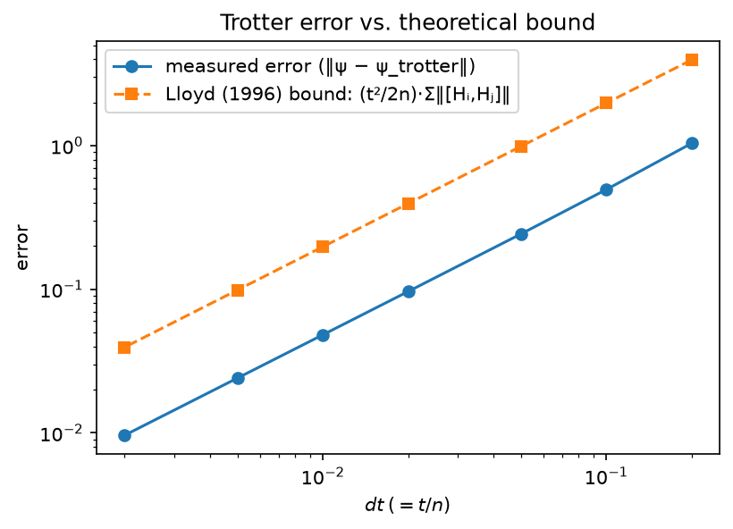
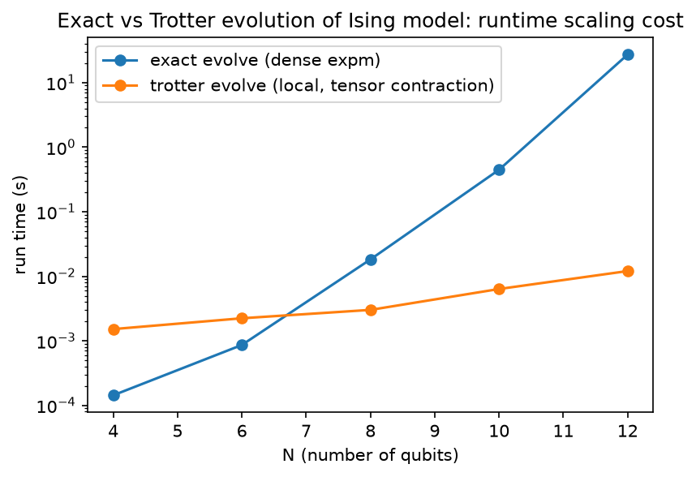

# Quantum Hamiltonian Simulation

Exact and Trotter-Suzuki simulation of the transverse-field Ising
model, and error/runtime analysis verified against theory.

## Why this repo

The aim is to build toward simulating open quantum systems. As a
concrete first step, this repo implements and verifies Hamiltonian
simulation via Trotterization — including an efficient,
local interaction implementation that demonstrates, classically,
why the method scales far better than dense simulation, and sets up
the connection to the genuine polynomial-time advantage Trotterization
provides on quantum hardware.

## Result

**Trotter error converges at the expected first-order rate, and
   within the theoretical commutator bound.**

For a first-order product formula, Lloyd (1996)	bounds the error by

```math
\vert\vert U - U_{\rm trott} \vert\vert \leq (t^2 / 2n)
\sum_{i \lt j} \vert\vert[H_i, H_j ] \vert\vert
```

where $U = e^{-iHt}$ is the exact evolution operator, and $U_{\rm
trott} = (e^{-iH_1t/n} \cdots e^{-iH_lt/n})^n$ is the $n$-step Trotter
product. Each local operator $e^{-iH_it/n}$ acts on a Hilbert space of only
$m=4$ dimensions (two neighboring qubits), rather than the full $2^N$
dimensional space of the whole system of N qubits in the full hilbert
space in $H$. This locality is what the efficient implementation
exploits directly, via tensor contraction rather than dense matrix
exponentiation.

The measured error tracks the bound's scaling closely; both
curves are parallel on a log-log plot, confirming the correct
first-order convergence rate, and the true error sits consistently
below the bound across the full range of step counts tested.

<!--  -->
<div align="center">
  
</div>

**The efficient (tensor-contraction) implementation is dramatically
faster.**

<div align="center">
  
</div>
<!--  -->

At $N=12$, exact matrix exponentiation takes ~27 s while the Trotter
step takes ~5 ms, roughly a 5400x speedup. The exact method grows
approximately as $e^{(1.53)N}$, which is somewhat less than the
expected cubic scaling $e^{ln(8)N}$ with cost $\mathcal{O}(8^N)$ for
dense matrix exponentiation (plausibly reflecting optimized linear
algebra routines in scipy's `expm` rather than a departure from the
theoretical asymptotic). The local implementation costs $\mathcal{O}(N
\cdot 2^N)$ per trotter step, since a classical computer must store
the full $\mathcal{O}(2^N)$ dimensional state. Both algorithms are
exponential in $N$, but trotterization's much smaller effective
exponent explains the dramatic speedup observed here. The genuine
polynomial-time advantage Trotterization is known for is specific to
real quantum hardware: a single local gate costs $\mathcal{O}(1)$,
independent of $N$, and a full Trotter step needs only
$\mathcal{O}(N)$ such gates, polynomial overall, not exponential.

## Setup
pip install -e .
pip install jupyter matplotlib ipykernel

## Repository structure

```
quantum-hamiltonian-simulation/
├── README.md
├── pyproject.toml
├── docs/
│   └── figures/
├── notebooks/
│   ├── exact_time_evolution.ipynb
│   ├── first_order_trotter.ipynb
│   └── error_scaling.ipynb
├── src/
│   └── hamsim/
│       ├── operators.py
│       ├── hamiltonian.py
│       └── evolution.py
└── tests/
    ├── test_operators.py
    ├── test_hamiltonian.py
    └── test_evolution.py
```

## Notebooks
- `exact_time_evolution.ipynb` — exact diagonalization and time evolution
- `first_order_trotter.ipynb` — first-order Trotter (dense vs. exact)
- `error_scaling.ipynb` — error scaling and runtime benchmark
(Second-order Suzuki: follow-up)